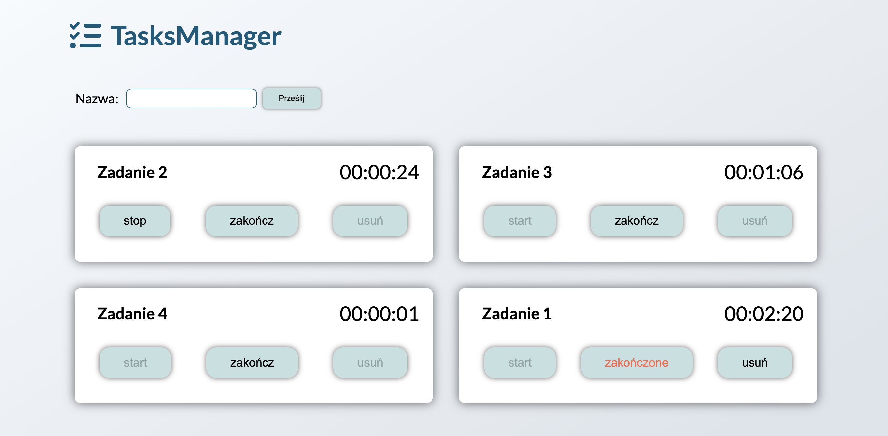

# Tasks Manager

TasksManager is an application used to manage tasks, it allows you to add new tasks and count the time of their completion.
The application was built in React using class components.. The tasks data is stored in a local database and retrieved using a local API (JSON Server).

**Main features**:

- Adding new tasks
- Task management:
  - start the countdown
  - stop the countdown
  - complete the task
  - delete the completed task

&nbsp;

## 💡 Technologies & tools


&nbsp;

## :gear: Installation

The project uses [node](https://nodejs.org/en/) and [npm](https://www.npmjs.com/).
To run it locally you should install all dependencies:

```
npm i
```

To run webpack and create a localhost port you should type:

```
npm start
```

If you don't have JSON server installed on your device use command:

```
npm install json-server -g
```

To run JSON server use command:

```
npm run json-server
```

Application is available at:

```
http://localhost:8080
```

&nbsp;

## 🙋‍♂️ Feel free to contact me

Find me on...

[](https://www.linkedin.com/in/jarosław-wąchała/)
[](mailto:jaroslaw.wachala@gmail.com)

&nbsp;

## 👏 Special thanks / Credits

Thanks to my [Mentor - devmentor.pl](https://devmentor.pl/) – for providing me with this task and for code review.
